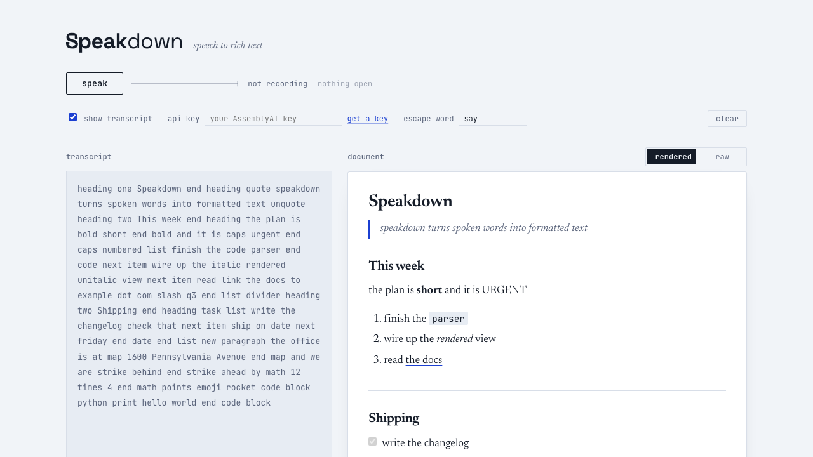

# Speakdown

*speech to rich text.*



Speak, and the formatting commands in what you say are parsed into a document —
headings, lists, emphasis, links, code blocks — rendered live as styled text or
as markdown. Spoken arithmetic collapses to its answer, a spoken date resolves
to an ISO date, and an address becomes a maps link.

<!-- TODO: add your deployed URL -->
**Live demo:** _add link_

## You need your own API key

Speakdown transcribes with [AssemblyAI](https://www.assemblyai.com), and a
deployed copy has no key of its own — each visitor brings their own, so nobody
else's quota is being spent.

1. Get a key at
   [assemblyai.com/dashboard/api-keys](https://www.assemblyai.com/dashboard/api-keys)
   (free tier is plenty).
2. Paste it into the **api key** field in the app.
3. Press **speak**.

The key is kept in your browser's local storage and nowhere else. It is sent
only to the app's own token endpoint, which exchanges it for a 60-second
streaming token. Use **forget** to remove it.

**No key?** You can still type into the transcript box and watch it parse. The
parser takes a plain string and does not care whether it came from a microphone
or a keyboard.

## What you can say

Commands are spoken plainly, with no prefix word. Marks and blocks open with one
phrase and close with another. To write a command word as ordinary text, put
`say` in front of it — `say bold` gives the word "bold".

| Inline marks | |
|---|---|
| `bold` | Close with `end bold` or `unbold` |
| `italic` | Close with `end italic` or `unitalic` |
| `strike` / `strikethrough` | Close with `end strike` or `unstrike` |
| `code` | Close with `end code` |
| `caps` / `all caps` | Close with `end caps` |

| Blocks | |
|---|---|
| `heading <1-6>` | `heading` alone is the top level. Close with `end heading` |
| `quote` | Close with `end quote` or `unquote` |
| `bullet list` | Close with `end list` |
| `numbered list` / `ordered list` | Close with `end list` |
| `task list` / `todo list` / `checklist` | Close with `end list` |
| `next item` | Start the next list item |
| `check that` / `uncheck that` | Tick or untick the task item you just spoke |
| `code block [language]` | Close with `end code block` |

| Transformations | |
|---|---|
| `math … end math` | `math 45 plus 12 plus 82 end math` → `139` |
| `date … end date` | `date next friday end date` → `2026-09-11` |
| `map … end map` | `map 1600 Pennsylvania Avenue end map` → a maps link |

| Structure | |
|---|---|
| `end format` | Close the most recently opened mark or block |
| `end all` | Close everything still open |
| `new line` | Soft line break |
| `new paragraph` | End the block, start a paragraph |
| `divider` / `horizontal rule` | Insert a horizontal rule |

| Insert | |
|---|---|
| `link <words> to <spoken url>` | `link the docs to example dot com slash q3` |
| `link <words> to clipboard` | Uses the URL on your clipboard |
| `emoji <name>` | `emoji thumbs up` |

| Editing | |
|---|---|
| `say <word>` | Write the next word literally, even a command word |
| `scratch that` | Undo the most recent action |

Anything that is not a recognized command is written out as ordinary text, so no
words are ever lost.

## Run it locally

```
npm install
npm run dev          # http://localhost:5173
```

You can paste a key into the app as above, or save yourself the retyping:

```
cp .env.example .env.local     # then add ASSEMBLYAI_API_KEY
```

`npm run dev` falls back to that value when the browser sends no key of its own.
Nothing else does: `npm run preview` does not serve that route, so a local
preview behaves like a real deployment. Every `.env*` file is gitignored.

```
npm test             # 434 tests
npm run build        # typecheck + production build
```

## Deploy

```
vercel deploy
```

`api/assemblyai-token.ts` is picked up as an Edge Function. **Set no environment
variables** — the deployed endpoint is meant to have no key, and refuses any
request that does not carry one.

It exists because AssemblyAI's token endpoint sends no CORS headers, so a browser
cannot call it directly even holding a valid key. The function makes that one
request and returns the token; the key is never stored, logged, or returned.

The handler is a plain `(Request) => Response`, so another host needs only a thin
adapter around `server/mintToken.ts`.

## Structure

```
src/
  model/     the document model and both renderers
  parser/    tokenize -> matchCommand -> readActions -> applyActions
  input/     microphone, AssemblyAI streaming, clipboard
  ui/        React
server/      token minting, shared by dev and production
api/         the deployed token endpoint
```

`model/` and `parser/` are pure TypeScript — no React, DOM, network or clock —
and `src/importBoundaries.test.ts` fails the build if that stops being true.

## License

MIT
